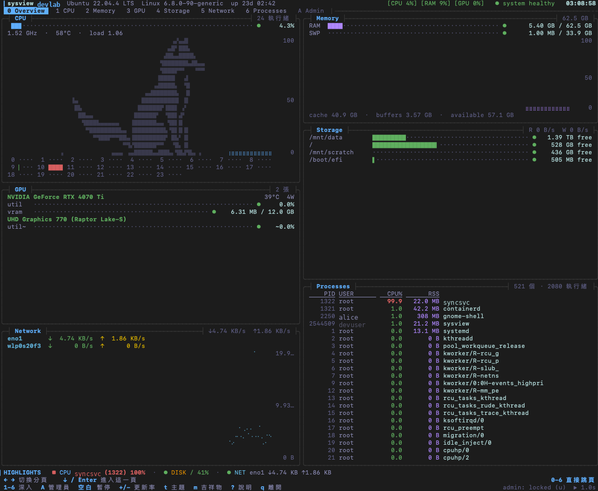
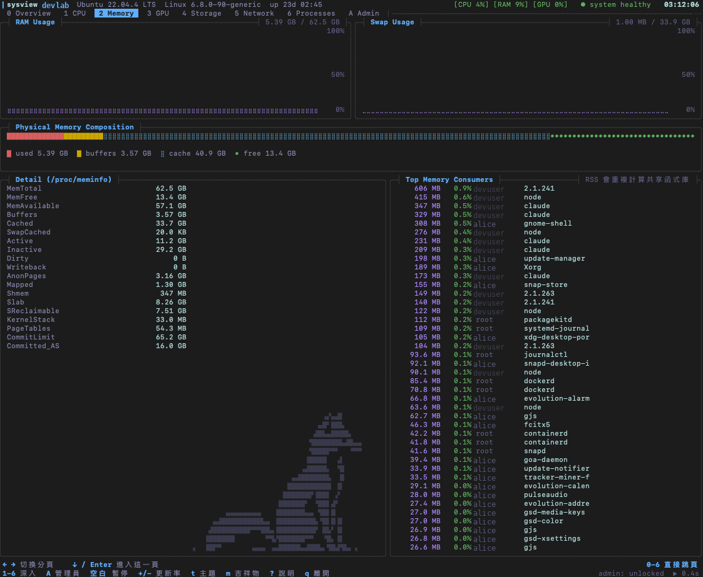
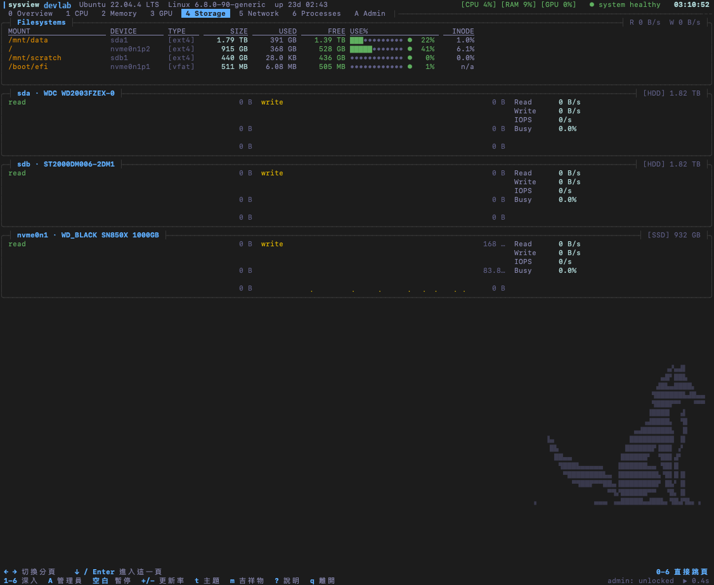
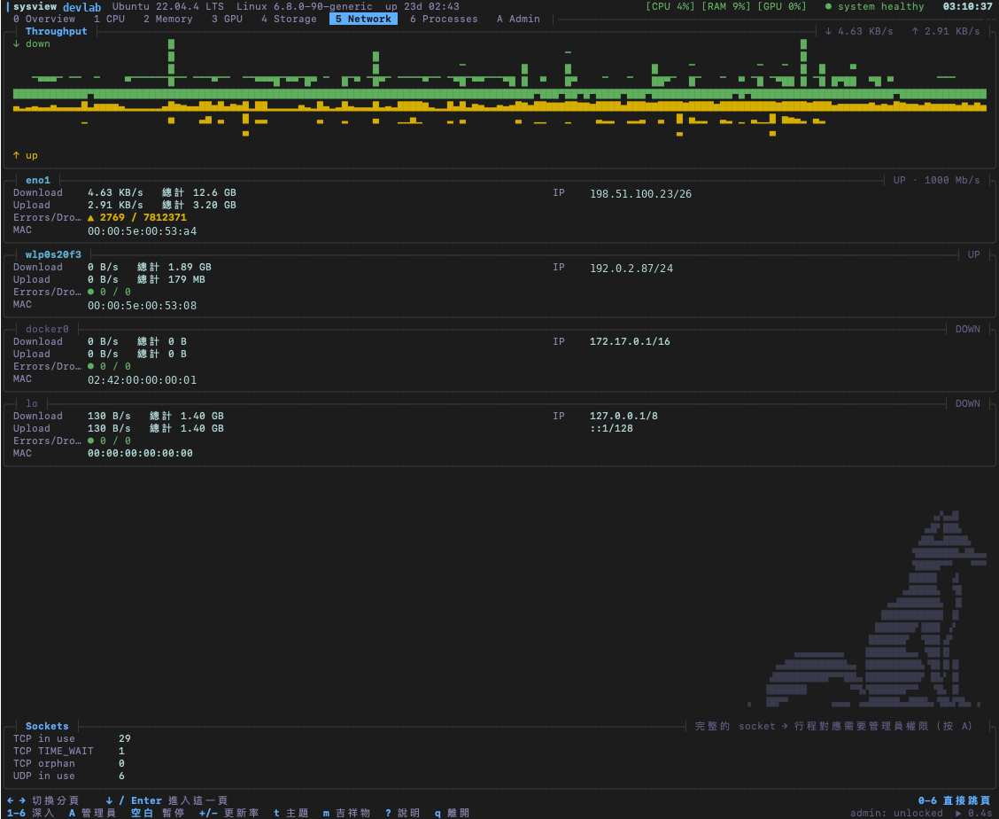
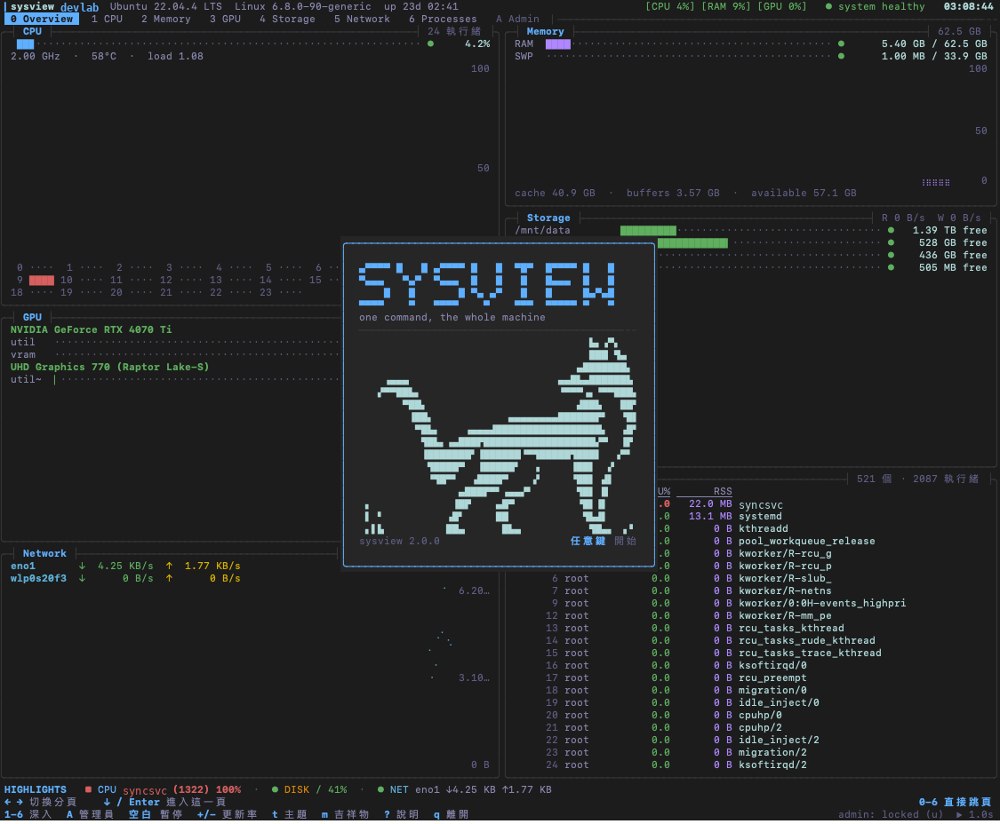

# sysview

一個指令看完整台 Linux 機器 —— CPU、記憶體、GPU、儲存、網路、行程。
在任何數字上按 `e`，它會告訴你這個數字是什麼、從哪裡讀來、怎麼算、哪裡容易誤判，
以及用哪個原生指令可以看到同一個值。

不需要 root。機器上每個帳號都能跑。



## 特色

- **每個數字都有來歷**：`e` 打開說明 —— 意義、算式、資料來源、常見誤解、對應的 `top` / `df` / `nvidia-smi` 指令。說明是編譯進去的，不會憑空生成。
- **看得出精確值與估計值**：拿不到的資料標成 unavailable，不會拿 0 假裝有值；估計值（例如 Intel 內顯使用率）標 `~`。
- **GPU 壞了會告訴你為什麼**：驅動沒載入、模組版本跟核心對不上、多個 dkms 版本打架 —— 診斷寫在畫面上。
- **多使用者機器的管理員頁**：誰佔了磁碟、誰吃了記憶體、誰在用 GPU。需要 sudo，但整支程式永遠以你自己的身分執行。
- **也能不互動**：`--snapshot` 純文字、`--json` 給程式讀、`--explain` 在終端機直接查一個 metric。

## 畫面

| | |
|---|---|
|  |  |
|  |  |

## 安裝

### 需要什麼

| | | 沒有的話 |
|---|---|---|
| 編譯 | Rust ≥ 1.88（用 rustup 裝在家目錄，不需要 root） | cargo 會直接說「請升級」 |
| | `cc`（gcc 或 clang）| 連結階段失敗 `linker 'cc' not found` |
| 執行 | Linux，`libc` + `libgcc_s` | 裝好之後其他人**不需要** Rust |
| 選用 | NVIDIA 驅動（`libnvidia-ml.so`） | GPU 頁只顯示能從 `/sys` 讀到的東西 |
| | `sudo` | 只有 Admin 頁用得到 |

Ubuntu / Debian 缺編譯工具的話：`sudo apt install build-essential`；
Fedora / RHEL：`sudo dnf install gcc`。只有編譯的那台機器需要。

### 第一次安裝

```bash
# 1. Rust（沒有的話）。裝完照它的提示重開 shell，或執行 . "$HOME/.cargo/env"
curl --proto '=https' --tlsv1.2 -sSf https://sh.rustup.rs | sh

# 2. 取得原始碼
git clone https://github.com/jay900411/sysview.git
cd sysview

# 3. 二選一
./install.sh          # 全機共用：編譯 + sudo 安裝到 /usr/local，含 Admin 頁
./install.sh --user   # 只給自己：編譯 + 裝到 ~/.local，完全不需要 root
```

`install.sh` 會先以你自己的身分編譯，只有複製檔案那一步用 sudo；
它不會改你的 sudo 設定，也不會建立 NOPASSWD 規則。

### 兩種安裝的差別

| | `./install.sh`（全機） | `./install.sh --user`（自己） |
|---|---|---|
| 需要 sudo | 複製檔案那一步要 | 完全不要 |
| 誰能用 | 這台機器上**每個帳號**，直接打 `sysview` | 只有你自己 |
| Admin 頁 | 有 | 沒有（它需要 root 擁有的 helper） |
| 恐龍彩蛋的排行榜 | 全機共用 | 只有自己（管理員裝過全機版之後會自動變成共用） |

裝到哪裡：

```
/usr/local/bin/sysview                    主程式，一般使用者執行
/usr/local/libexec/sysview/sysview-priv   Admin 頁用的 helper：root:root 0755，不帶 setuid
/usr/local/share/doc/sysview/             文件
/var/lib/sysview/dino/                    彩蛋排行榜（1777，每人只能寫自己的檔）

~/.local/bin/sysview                      --user 的主程式（確認 ~/.local/bin 在 PATH 上）
~/.local/share/doc/sysview/               文件
```

### 更新與移除

```bash
git pull && ./install.sh          # 或 ./install.sh --user
sudo make uninstall               # 全機版移除
rm ~/.local/bin/sysview           # --user 版移除
```

## 使用

```bash
sysview                 # 互動儀表板
sysview -v gpu          # 直接開 GPU 頁
sysview -i 0.5          # 每 0.5 秒更新
sysview --no-gpu        # 不載入 NVIDIA 函式庫，常駐記憶體約 4 MB
```

### 鍵盤

| 鍵 | 作用 |
|---|---|
| `← →` | 切換分頁 |
| `↓` / `Enter` | 進入這一頁；再按 `Enter` 往裡鑽一層（面板 → 列 → 單一數字） |
| `↑ ↓ ← →` | 在同一層之間移動（照畫面上的位置） |
| `Esc` | 退回上一層 |
| **`e`** | **解釋框住的那一格** |
| `0`–`6` | 總覽 / CPU / 記憶體 / GPU / 儲存 / 網路 / 行程 |
| `A` | 管理員頁 |
| `Tab` `Shift-Tab` | 依序切頁 |
| `空白` | 暫停 / 繼續 |
| `+` `-` | 更新頻率 0.2–10 秒 |
| `s` `/` | 行程頁：換排序 / 篩選 |
| `t` `m` | 換主題 / 換吉祥物 |
| `?` | 完整說明 |
| `q` | 離開 |

### 按 `e`

被框住的那一格是什麼，說明就是什麼：一個 metric 會給意義、算式、來源、陷阱、原生指令；
一個具體的東西（某張 GPU、某個網路介面、某個行程、某個掛載點）會給它的實測資料。

```
╭─┤ GPU Utilization ├────────────────────────┤ gpu.util · % ├╮
│ What is this?                                              │
│ 取樣區間內，GPU 上至少有一個 kernel 在執行的時間比例。     │
│ Formula   驅動統計的「有 kernel 活動」時間 ÷ 取樣區間      │
│ Source    NVML: nvmlDeviceGetUtilizationRates              │
│ Pitfalls  ! 這不是 CUDA core 佔用率 —— 一個只用 1% SM 的   │
│             kernel 一直跑，也會顯示 100%。                  │
│ Native    $ nvidia-smi dmon   $ nvtop                      │
╰────────────────────────────────────────────────────────────╯
```

### 頁面

| 頁 | 內容 |
|---|---|
| Overview | 全部子系統一眼看完，底部一列 Highlights 指出目前最該注意的事 |
| CPU | 總使用率、每核使用率 / 頻率 / 溫度、load、context switch、中斷、cgroup 配額 |
| Memory | 用量、cache / buffers、swap、組成比例、完整 `/proc/meminfo`、最耗記憶體的行程 |
| GPU | 使用率、VRAM、溫度、功耗、時脈、P-state、PCIe、compute 行程；驅動有問題時顯示診斷 |
| Storage | 掛載點（與 `df` 一致）、每顆裝置的讀寫 / IOPS / 忙碌率 |
| Network | 每個介面的速率、累計流量、錯誤、IP / MAC，socket 統計 |
| Processes | 可排序、可篩選、可捲動的行程清單，每一列都能 `e` |
| Admin | 各使用者的磁碟 / 記憶體（含 PSS）/ VRAM 用量、socket 對應行程。需要 sudo |

### Admin 頁（需要 sudo）

按 `A` 進入、`u` 解鎖。解鎖時 sysview 會把終端機交給 `sudo` 讓它自己問密碼 ——
sysview 不讀、不存、不轉送你的密碼。取得 root 的只有一個很小的 helper
（`sysview-priv`），做完一件 allowlist 上的事就結束；整支 TUI 從頭到尾是你自己的身分。
誰能解鎖由系統的 sudoers 決定，不是由 sysview 決定。細節與收緊方式見
[docs/sudo.md](docs/sudo.md)。

### 非互動

```bash
sysview --snapshot                 # 純文字快照（沒有 TTY 時自動採用）
sysview --json | jq .              # 機器可讀；權限跟互動模式一樣，不會多給
sysview --explain cpu.load         # 直接查一個 metric 的說明
sysview --list-metrics             # 全部可解釋的 metric
watch -n5 'sysview --snapshot'
```

### 設定檔（選用）

`~/.config/sysview/config.toml`，用 `sysview --print-config` 印出帶註解的範本。常用的幾項：

```toml
interval = 1.0          # 更新間隔（秒）
theme = "default"       # default / high-contrast / catppuccin / tokyo-night / nord / gruvbox / dracula
default_page = "overview"
gpu = true              # false = 不載入 NVIDIA 函式庫

[branding]
name = "MYLAB"          # 頁首與啟動畫面的代號，A–Z 0–9，最多 6 字
mascot = "fox"          # fox / deer / none
```

設定檔管不到權限：裡面沒有任何「開啟管理員」的欄位，多寫了會直接報錯。

## 安全與隱私

- 整支程式以你的身分執行；提權只經過 sudo，helper 不帶 setuid、不常駐。
- 不讀 `/proc/<pid>/environ`（環境變數裡常有 token）。
- 不寫暫存檔、不寫 log；唯一會寫的檔是你自己的彩蛋排行榜紀錄。
- 網路頁只看統計，不擷取封包、不做 DNS 反解。
- `--json` 遵守與互動模式相同的權限。

完整分析：[docs/security.md](docs/security.md)。

## 疑難排解

| 現象 | 原因 / 處理 |
|---|---|
| `找不到 cargo` | 重開 shell，或 `. "$HOME/.cargo/env"`；還沒裝的話見上面第 1 步 |
| `linker 'cc' not found` | 裝 `build-essential`（Debian / Ubuntu）或 `gcc`（Fedora） |
| Admin 頁顯示 `helper not installed` | 用的是 `--user` 版；請管理員跑一次 `./install.sh` |
| Admin 頁顯示 `not authorized` | sudoers 沒有給你權限，這是系統的決定 |
| GPU 頁沒有 NVIDIA 卡 | 沒有驅動，或驅動跟核心版本對不上 —— 頁面上的診斷會指出哪一項 |
| 顏色很淡或框線怪 | 終端機沒宣告 truecolor 時走 256 色；`NO_COLOR=1` 可以完全關掉顏色 |
| 畫面太小 | 最小 50×12；更小會直接提示 |

## 已驗證的環境

Ubuntu 22.04（Linux 6.8、glibc 2.35、i7-13700、RTX 4070 Ti + Intel UHD 770）實機；
CI 另外在 Debian 12 容器（沒有 GPU、沒有感測器、沒有 Rust）跑同一個執行檔，
並確認 `--user` 安裝不需要 root。AMD GPU、多 GPU、ARM、musl 有寫但沒有實機測過。
其他細節、設計取捨與量測數字在 [docs/design.md](docs/design.md)。

## 開發

```bash
make            # 編譯 release
make lint       # fmt + clippy
cargo test --all-features
```

## 授權

MIT（見 `LICENSE`）。恐龍彩蛋的剪影衍生自 Chromium 的像素畫，保留其 BSD-3-Clause 聲明，
見 `THIRD_PARTY_NOTICES.md`。
